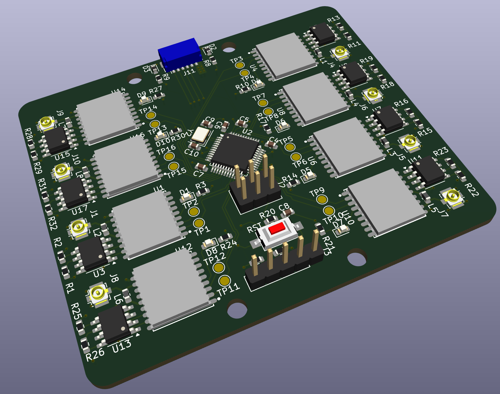
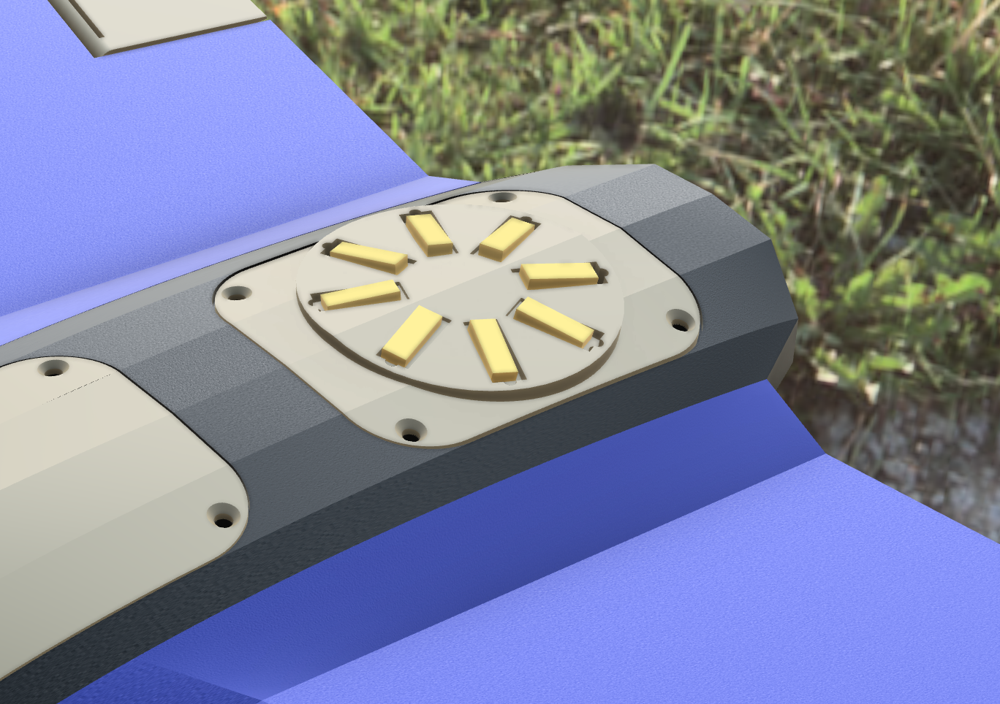

# GPS Fusion Array with STM32F103

This repository contains the full design files, schematics, and firmware for a **GPS Fusion Array**:
a custom PCB with **8 ATGM336H GNSS modules** and an **STM32F103 MCU** that collects data from all receivers,
performs **real-time fusion**, and outputs the combined solution over **SPI**.



## Support on falconEdge

[FalconEdge repository](https://github.com/rmingon/Falcon-Edge)



---

## Project Overview

| PCB Layout | Schematic     | 3D View |
| ---------- | ------------- | ------- |
| pcb.png    | schematic.png | 3d.png  |

---

## Key Features

- **8× ATGM336H GPS modules** for redundant positioning
- **STM32F103** microcontroller for acquisition and fusion
- **SPI output interface** for fast integration with a master controller
- **Per-module power filtering** and **careful ground plane partitioning** to reduce RF interference
- **Compact, mountable PCB** with 3.3 V power input

---

## Why an Array of GPS Modules?

Traditional single-GPS solutions suffer from multipath, interference, and occasional dropouts.
Using 8 GPS modules in parallel offers:

- **Redundancy:** Even if one receiver loses lock, others keep tracking.
- **Noise Reduction:** Position noise is reduced by averaging multiple solutions.
- **Outlier Rejection:** Bad data can be discarded automatically.
- **Improved Accuracy:** Fusion of multiple measurements yields a more stable, reliable solution.

---

## RF & Interference Mitigation

This PCB design includes several techniques to minimize interference and maintain clean GNSS reception:

- **Dedicated RF Ground Plane:** Each GPS module has local ground pour to reduce mutual coupling.
- **Power Filtering:** Each module’s VCC line is decoupled with LC filters for low-noise operation.
- **Symmetric Layout:** GPS modules are evenly distributed to reduce antenna detuning.
- **Isolated Digital Section:** MCU and SPI routing are kept away from RF traces to reduce emissions.

---

## Data Fusion Algorithm

The STM32F103 runs a lightweight fusion algorithm:

- **NMEA Parsing** from all modules
- **Timestamp Synchronization** for simultaneous position updates
- **Weighted Average & Kalman Filtering** using HDOP as weight
- **Fault Detection:** Rejects outliers and maintains smooth position tracking

---

## Firmware

Features:

- **Complete NMEA Parsing** Supports GGA, RMC, GSA, GSV, VTG, and GLL sentences
- **Interrupt Support** Optional interrupt-driven data reception
- **Comprehensive Data** Position, time, satellites, signal quality, movement data
- **Signal Quality Analysis** SNR monitoring and satellite constellation health

---

## ATGM336H Technical Summary

| Parameter            | Specification                    |
| -------------------- | -------------------------------- |
| Constellations       | GPS, BeiDou, GLONASS, QZSS, SBAS |
| Positioning Accuracy | ~2.5 m CEP                       |
| Cold Start           | < 35 s                           |
| Hot Start            | < 1 s                            |
| Update Rate          | Up to 10 Hz                      |
| Supply Voltage       | 2.8 – 4.3 V                      |
| Interface            | UART (NMEA)                      |
| Tracking Current     | ~26 mA                           |
| Operating Temp       | -40 °C to +85 °C                 |

---

## Hardware Details

- **MCU:** STM32F103C8T6
- **GPS:** 8× ATGM336H modules
- **I/O:** SPI slave output, UARTs for module communication
- **Power:** Single 3.3 V input, on-board filtering
- **Board:** 4-layer PCB, optimized RF layout

---

## Repository Structure

```
/hardware       # KiCad project files, schematics, PCB layout
/firmware       # STM32 source code for GPS fusion and SPI output
/docs           # Project documentation, images, diagrams
```

---

## Getting Started

1. **Assemble the PCB** and mount the GPS modules and STM32.
2. **Flash the firmware** using ST-Link.
3. **Connect SPI** to your master controller (e.g., Raspberry Pi or another STM32).
4. **Power the board** with 3.3 V regulated input.
5. **Start reading fused GPS data** from SPI.

## License

This project is licensed under the **CERN Open Hardware Licence Version 2**. See `LICENSE` file for full terms.
